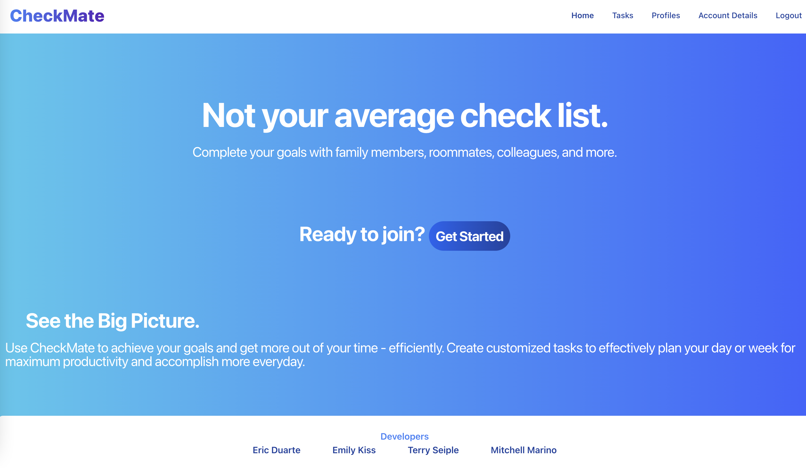
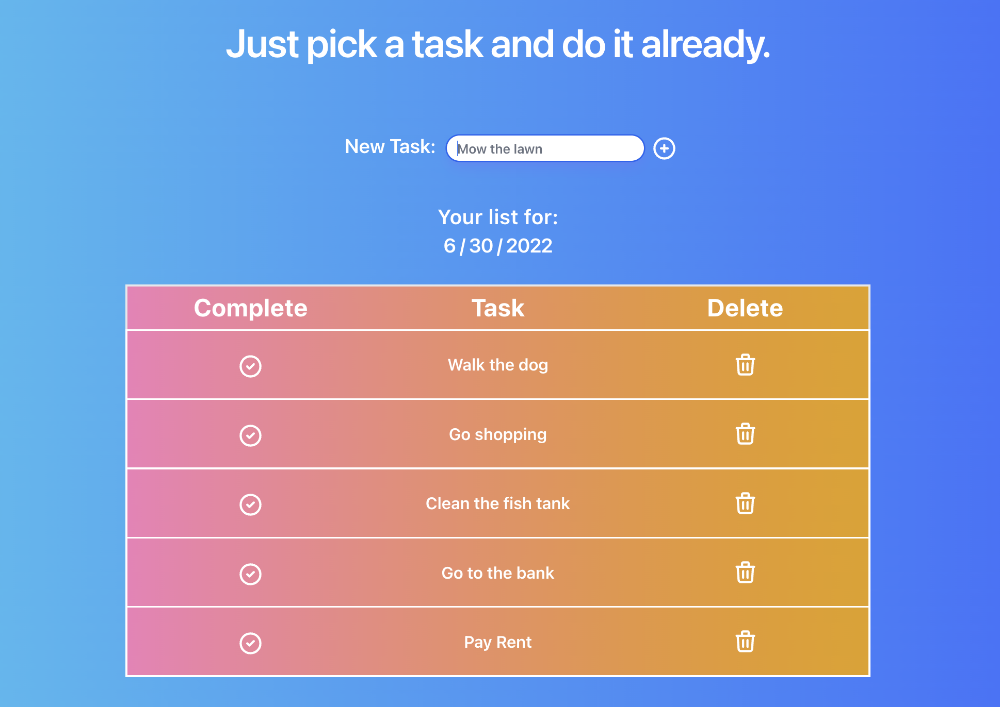

# Checkmate 

#### Developed by:
Eric Duarte, Emily Kiss, Mitchell Marino, Terry Seiple

#### Deployed Link: 
<httpfjkads;klfjdksa;>





## Technologies:
* React
* Node/Express 
* MongoDB
* Mongoose
* Tailwind CSS / Flowbite

## Our Approach
We began the project by utilizing a Miro board to map out almost every aspect of the project including the MVP goals, RESTful routes, views, a component tree, an ERD, as well as a to-do section. Once we had everything layed out, we started by mob-coding the back-end so that we were all on the same page with how our server was functioning. Once we had the back-end framework in place, we shifted to working on the front end. 

We identified which components would need certain properties, then passed those down so that once our App.js was configured and the properties were passed, we could split up and start coding the front-end without multiple members going back to App.js to add more code. We each tackled a different section of the front-end by laying the groundwork of the functionality for each component. This led to what our basic work-flow would become: mob-code when we needed extra brain power on a problem or when we didn't want to step on other member's toes, and then split up and work on smaller portions when we knew it wouldn't interfere with another member's work. 


## User Stories: 

*  As an unregistered user, I would like to create an account with email and password.
*  As a registered user, I would like to sign in to the account with email and password.
*  As a signed in user, I would like to create, view, edit, and delete profiles.
*  As a user, I would like to select a profile to sign in to. 
* As a signed in user, I would like to be able to check off items on the todo list.
* As a user, I would like to share my account with others, where they can create profiles and view task items and check them off the todo list.
* As a user, I would like to be able to see if other profiles on my account have already completed a task


## Wireframes: 

### Home page Path: '/'


### Task page Path: '/'


### Account page Path: '/'


## Installation Instructions: 
Create a new directory to store the server and client repos. Cd into the directory and clone this repository (client) and the server repository. 

#### Client Setup
Navigate into the cloned version of the client repo. Run the command ```npm -i``` to install all dependencies. 

Run ```touch .env.local``` and open that file in your text editor. Copy and paste the following text: 
```
REACT_APP_SERVER_URL=http://localhost:8000
```

Run ```npm start``` to initialize the react app. 

#### Server Setup 
Navigate into the cloned version of the server repo. Run the command ```npm -i``` to install all dependencies.

Run ```touch .env``` and open that file in your text editor. Copy and paste the following text, replacing YOUR_SECRET_CODE with a unique sequence: 
```
JWT_SECRET=YOUR_SECRET_CODE_HERE
```
Run ```nodemon``` to initialize the react app. 


Congrats! You are now ready to run the full app on your local machine. 


## RESTful Routing Chart 


## Major Hurdles

Often times we learned that placing something in state was the easiest solution to a problem. It took us a few hours of hitting our heads against a wall to realize this, but I think we've all learned that the tools that React provides should be some of the first that we reach for when building a React app. Navigating merge conflicts was an issue that we were all very aware of, and really only had trouble with a few times. Understanding when React wants to render/update a change on the page was also a learning process, and I think we've learned that utilizing vanilla JS as well as React functions together is the key to making a seamless React app.
